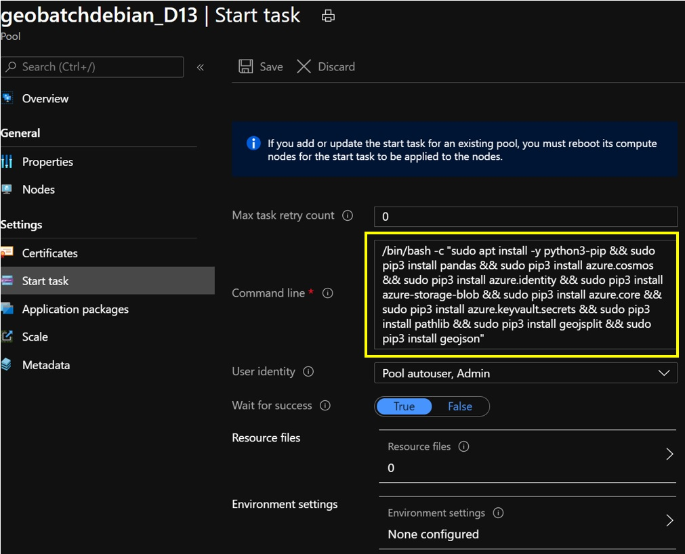
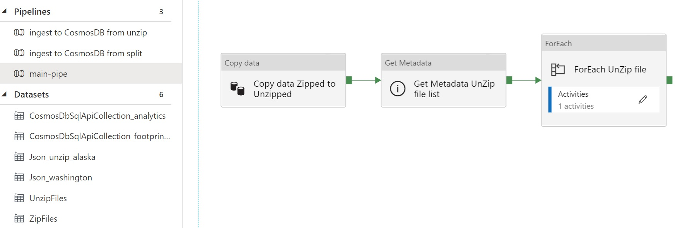
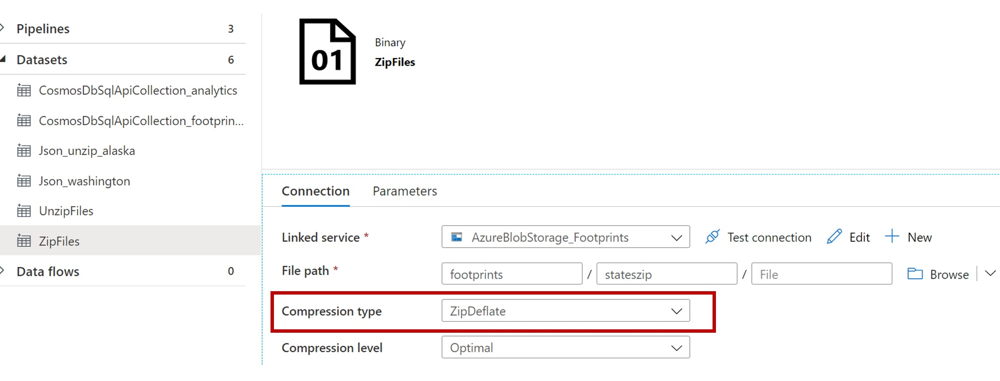
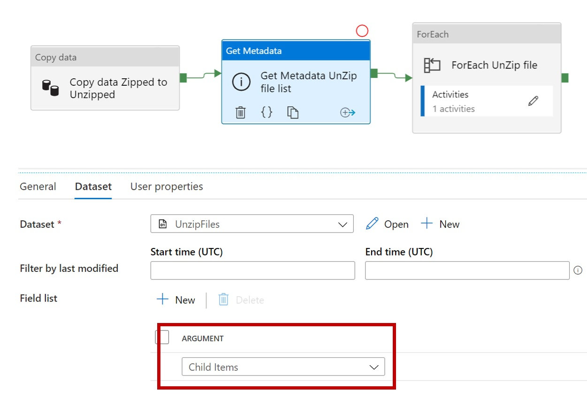
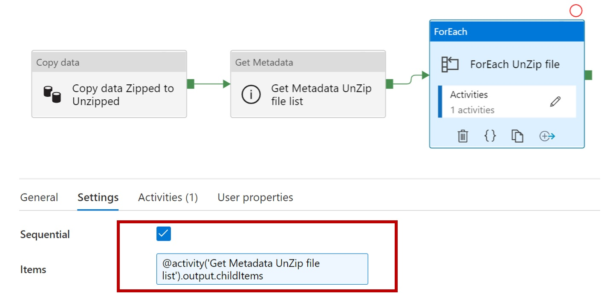
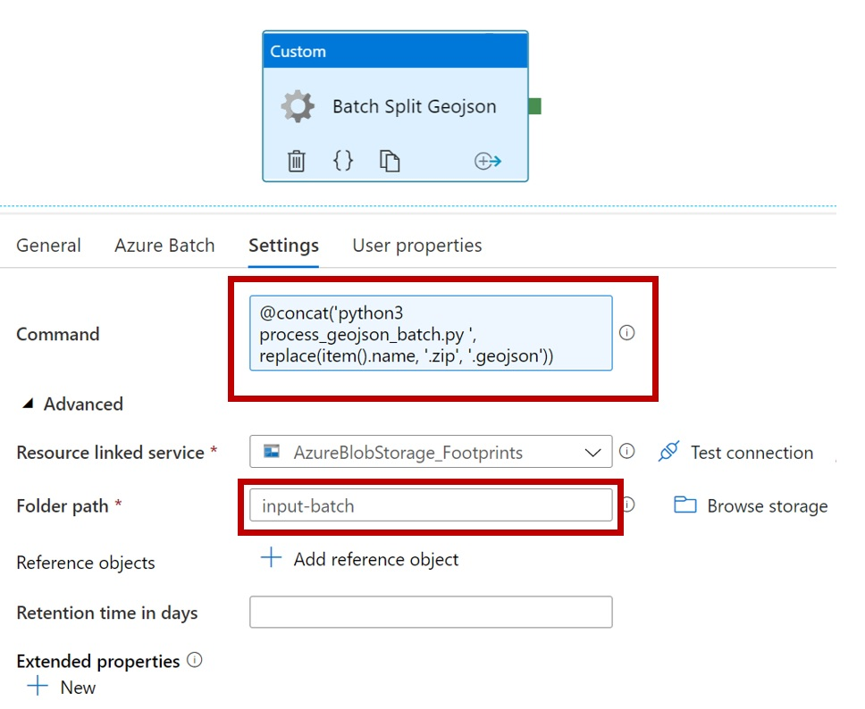
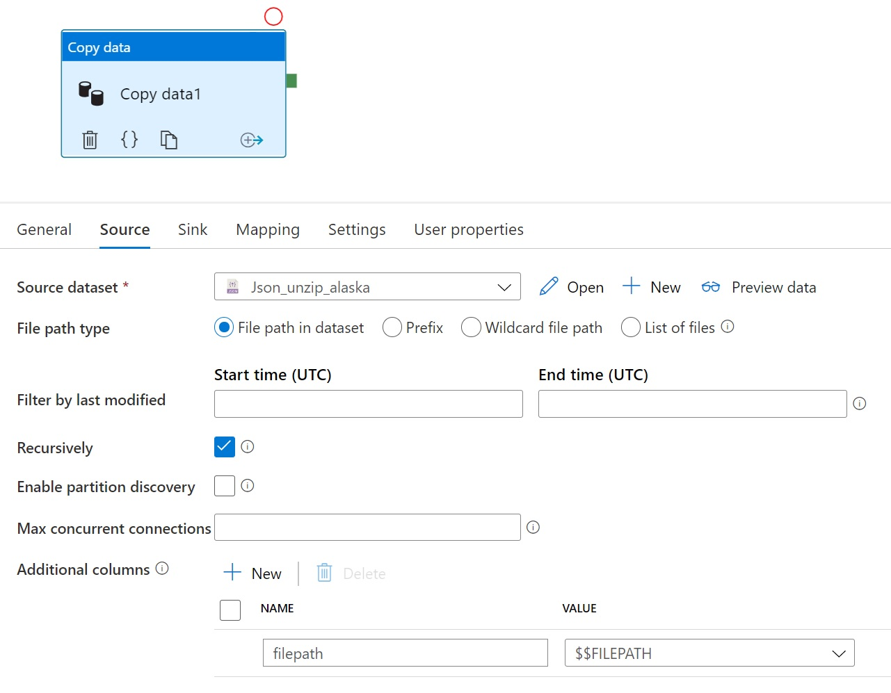
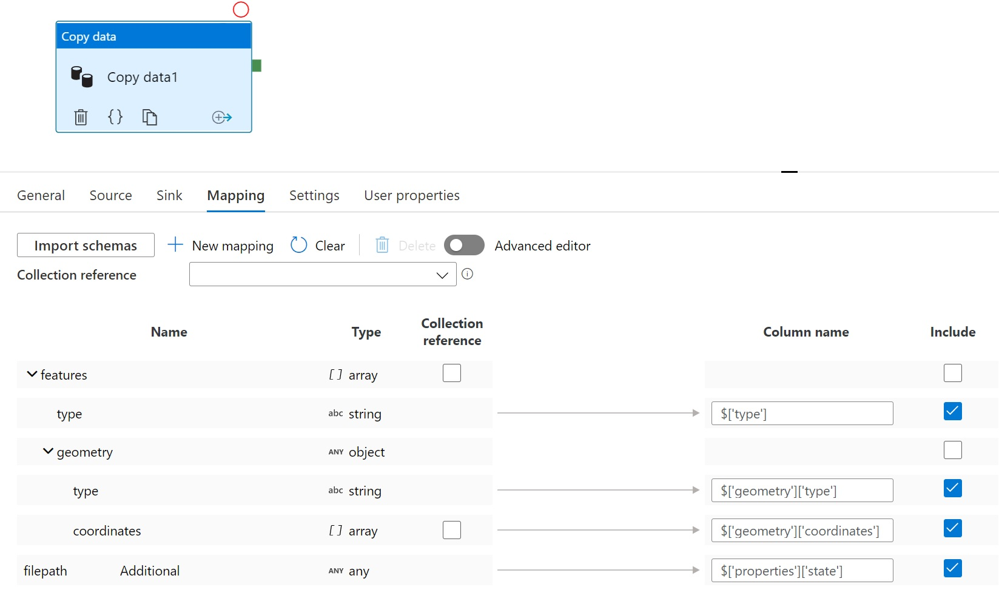
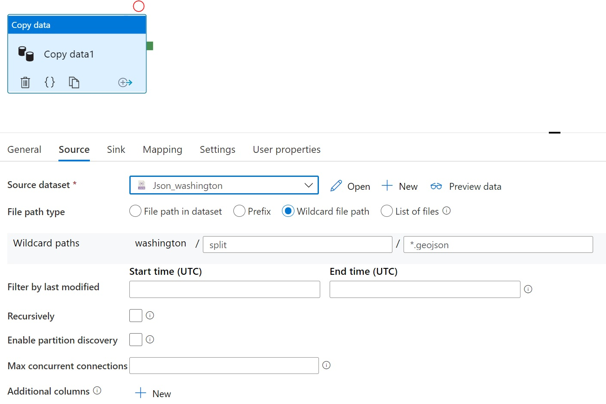
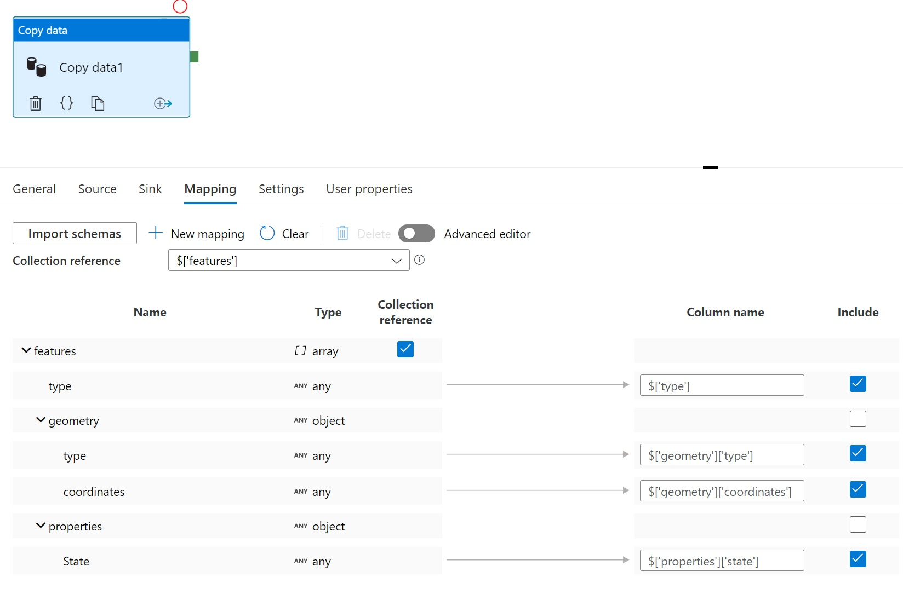

# Azure Data Factory pipelines

Three pipelines are given:
1) main-pipe : for both experiments and common usage
2) ingest to Cosmos DB from unzip : for common usage
3) ingest to Cosmos DB from split : for experiments

## 1. Main-pipe
With the main pipe the zipped geojson will be unzipped, and each of the individual US state building footprint files (geojson) will be processed and split into small geojson files. 

#### Step 1
Copy the State.zip from its [source](https://github.com/microsoft/USBuildingFootprints) to your blob container (with for example an ADF copy activity, or with Azure Storage Explorer). Here the container name 'footprints' has been used, place the zip files in a folder named 'stateszip'. Best is to usa a separate Azure Resource Group for this project.
 
 

#### Step 2
Copy the [python scripts (3x)](./../ProcessGeospatialAndQueryCosmosDB) and put them in the folder named 'input-batch', in the footprints container. Fill your blob connection string (replace the stars) in the constants.py file.

#### Step 3
In the Azure Resource Group used for this project, start the following services:
- Azure Data Factory
- Azure Cosmos DB
- Azure Batch (experimental branch only)

  With Azure Batch, make use of Linux VMs. And use 'Set Tasks' in order to install python and the needed libraries on each VM in the pool (yellow):

#### Step 4
In Azure Data Factory import the ARM templates provide in this folder: use the 'Build your own template in the editor' and load the arm_template.json, if the file does not load, just paste the content in the editor. Hit save, and provide the credential details for the services already provisioned in step 3. This will build up all 3 pipelines, and set the data sets. Adjust the activity settings to your naming convention of the resources.

#### Step 5
If you use this pipeline only for common usage (no Azure Batch), remove the Get Metadata and the ForEach activities (Copy activity remaining).

#### Pipe explained

The pipeline exists of 3 activities, see below overview of the pipeline

 

#### Copy activity
The first activity is a copy activity, and this is the only part needed when using this pipeline for common usage (no Azure Batch). 
The activity just copy the source files (zip) from blob to blob; simply from binary dataset source to binary dataset sink (no parameters needed). And by doing so making use of the baked in unzip feature - defined at the datasets level, see figure below (red):

 

#### Get Metadata
The second activity, concerns merely to get the list of geojson file names from /footprints/statesunzip/
With the ChildItems set, within each iteration (third activity) the filename can be set to 

 

#### ForEach + Azure Batch
The third activity iterates over the parsed list of geojson. Each childItem is set to Item (thus each individual state.geojson file can be refered to Item). You can check out the Sequential box in order to process states in parallel.

 

Within the ForEach activaty an Azure Batch activity will start.
Here the reference to the python scripts can be made under folder path (red box), and the command to start the python script on the Azure Batch VM (linux).

 
 

## 2. Ingest to Cosmos DB from unzip

To load directly data from the unzipped source files (type geojson) from blob to CosmosDB, use the 'ingest to Cosmos DB from unzip' ADF pipeline. The geojson is split into individual features by a copy activity, and loaded as one feature per document. 

### Copy Activity

The activity adds one property into each feature, to provide candidates for use as a partition key:
- filename of source geojson

  

In the output, the filename is mapped to: 
- properties.state

  

Note that this pipeline assumes that the geojson has already been unzipped and stored in blobstore as a geojson file in a separate copy activity step (see the copy activity in the 'main-pipe' above). 

The source dataset is a hardcoded pointer to a specfic file - this could be paramterised in the pipeline.

The sink (here the dataset CosmosDbSqlApiCollection_footprints_unzip) is a Cosmos DB with an existing database called `footprints_split` and a container called `footprint_unzip`. The partition key must be set to  `/properties/state`.

> **Note: This sample is not optimised or throttled for copy performance. Suggest scaling up RU's and turning off indexing in Cosmos DB for the initial import.**

After the ingestion of all features, the Cosmos DB container can be [indexed by geography](https://docs.microsoft.com/en-us/azure/cosmos-db/sql-query-geospatial-index#geography-data-indexing-examples):

## 3. Ingest to Cosmos DB from split

To load data from the split files (results from the main-pipe) from blob to CosmosDB, use the 'ingest to Cosmos DB from split' ADF pipeline. The geojson files are split into individual features and has already the propertie State assigned during the main-pipe. The copy activity is thus to load the data as one feature per document. 

### Copy Activity

The activity makes use of a wildcard reference to the source files (\*.geojson):

  

In the output, the existing properties.State is mapped to: 
- properties.state

  

The sink (here the dataset CosmosDbSqlApiCollection_analytics) is a Cosmos DB with an existing database called `footprints_split` and a container called `footprint_analtyics`. The partition key must be set to  `/properties/state`.

> **Note: This sample is not optimised or throttled for copy performance. Suggest scaling up RU's and turning off indexing in Cosmos DB for the initial import, and with the copy activity increase the degree of copy parallism (under settings).**

After the ingestion of all features, the Cosmos DB container can be [indexed by geography](https://docs.microsoft.com/en-us/azure/cosmos-db/sql-query-geospatial-index#geography-data-indexing-examples) (see example figure under 2. Ingest to Cosmos DB from unzip

