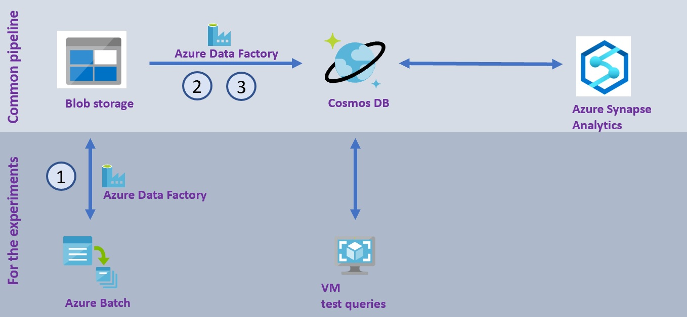
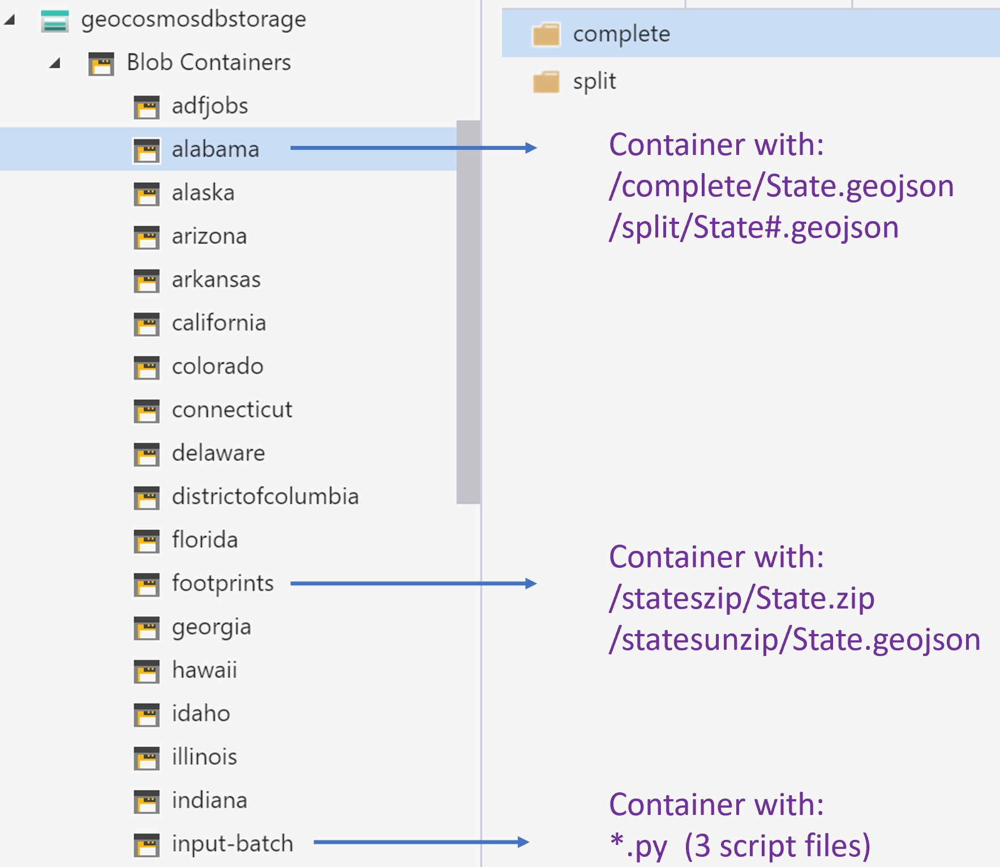

# Azure Data Factory pipelines

Three pipelines are given:
1) main-pipe : for both experiments and common usage
2) ingest to Cosmos DB from unzip : for common usage
3) ingest to Cosmos DB from split : for experiments

## main-pipe
With the main pipe the zipped geojson will be unzipped, and each of the individual US state building footprint files (geojson) will be processed and split into small geojson files. 

#### Step 1
Copy the State.zip from its [source](https://github.com/microsoft/USBuildingFootprints) to your blob container (with for example an ADF copy activity, or with Azure Storage Explorer). Here the container name 'footprints' has been used, place the zip files in a folder named 'stateszip'. Best is to usa a separate Azure Resource Group for this project.
 
 

#### Step 2
Copy the [python scripts (3x)](./../ProcessGeospatialAndQueryCosmosDB/README.md) and put them in the folder named 'input-batch', in the footprints container.

#### Step 3
In the Azure Resource Group used for this project, start the following services:
- Azure Data Factory
- Azure Batch (experimental branch only)

#### Step 4
In Azure Data Factory import the ARM templates provide here. This will build up all 3 pipelines, and set the data sets. Adjust the activity settings to your naming convention of the resources.

## ingest to Cosmos DB from unzip

## ingest to Cosmos DB from split

# ADF implementation for loading geojson

This folder contains an ADF-only implementation for loading featurs from a geojson file into CosmosDB. The geojson is split into individual features by a copy activity, and loaded as one feature per document. 

### Copy Activity

The activity adds two properties into each feature, to provide candidates for use as a partition key:
- filename of source geojson
- guid (generated, same value for all features in the file)

  

In the output, these are mapped to: 
- properties.state
- properties.partitionKey

  

The [pipeline](./pipeline) folder contains a simple pipeline that holds only the single copy activity. This assumes that the geojson has already been unzipped and stored in blobstore as a geojson file in a separate copy activity step. 

The [source dataset](./dataset/geojson.json) is a hardcoded pointer to a specfic file - this could be paramterised in the pipeline.

The [sink](./dataset/CosmosDbSqlApiCollection1.json) is a Cosmos DB with an existing database called `geojson` and a container called `features`. The partition key must be set to either `/properties/partitionKey` or `/properties/state`.

> **Note: This sample is not optimised or throttled for copy performance. Suggest scaling up RU's and turning off indexing in Cosmos DB for the initial import.**

