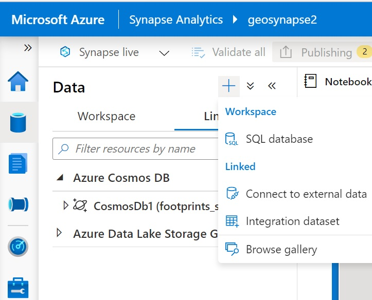
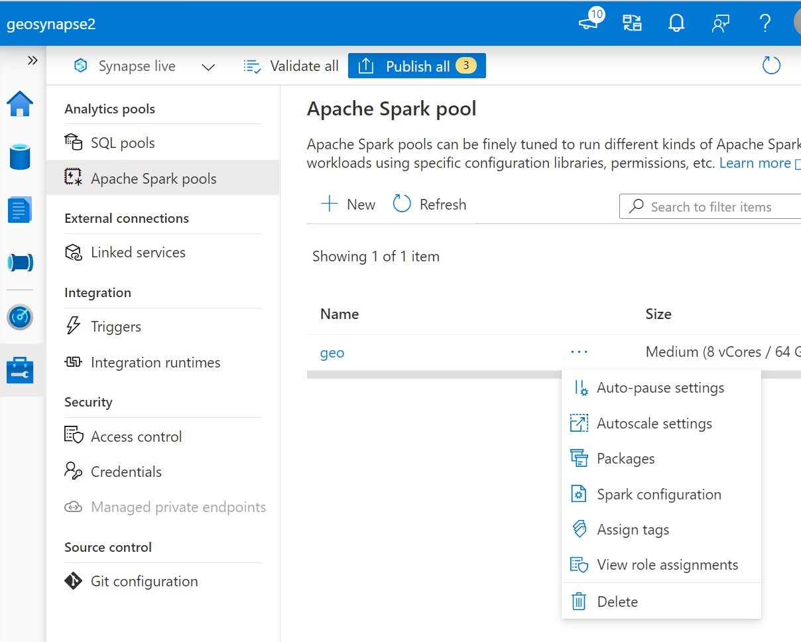
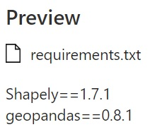
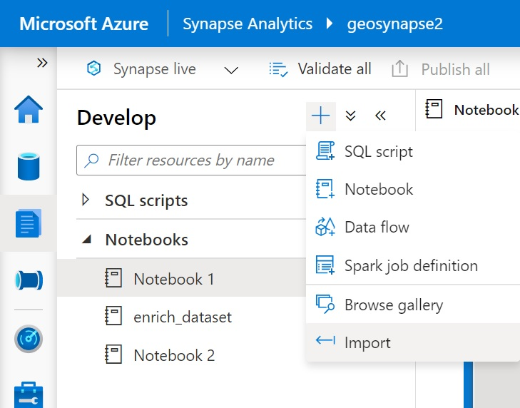
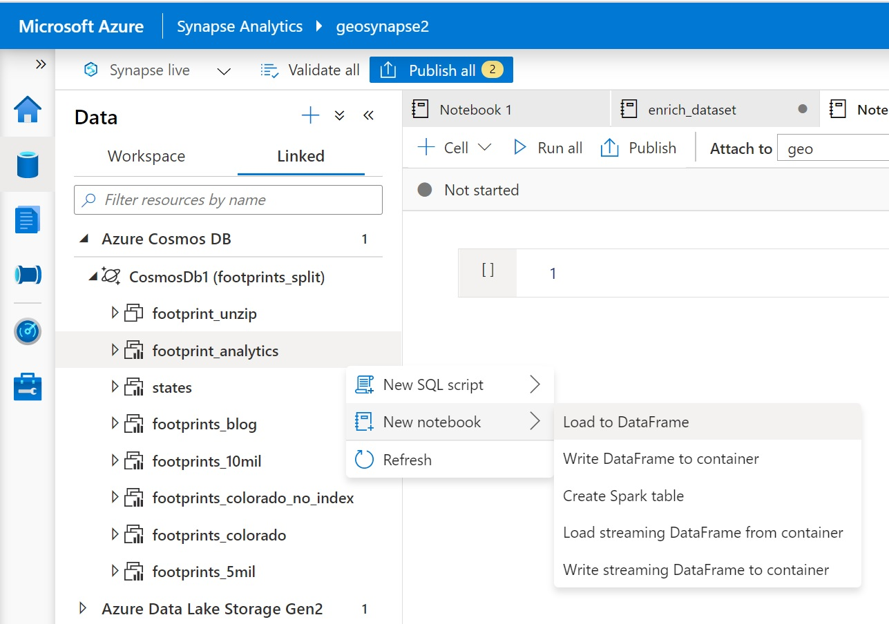

### Analyse geospatial data with Synapse Anylitics

#### Create link from Synapse to Cosmos DB
In the Synapse Studio, Data tab, of Azure Synapse Analytics one can create a direct link to Cosmos DB, see below image:

#### Add libraries to Spark pool
You can add open source libraries to your Spark pool. Do the following, create a txt file: requirements.txt with a list of the needed libraries and versions (for this project you need geopandas and shapely. Within Synapse Studio, Manage tab / Apache Spark Pools, under more (three dots ...) at your Spark Pool, select Packages:

Here you can upload your requirements.txt:

You need to restart the pool to get the libraries being installed.

#### Import Notebook
Then, from the Development tab, the provided notebook can be imported:

This notebook demonstrates how the building footprints can be enriched with other data, like with the calculated area. For doing so, the geographical coordinates need to be projected, and here we transfer from WGS 84 to US National Atlas Equal Area as the data set.

#### As an alternative to import, start a new Notebook
Alternatively, you can start a new notebook and it loads your data already as dataframe, or Spark table:

