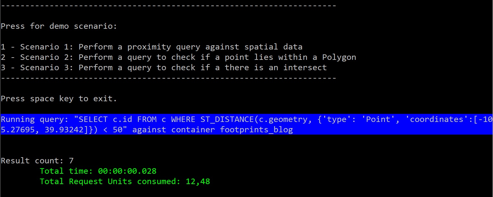

### Performance tests against Azure Cosmos DB

Performance test were done with a c# application. You only need to add your Cosmos DB connection string, the key, and database and container name in the App.config file. Within the app, the three tests can be called:

