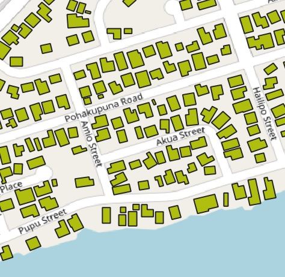
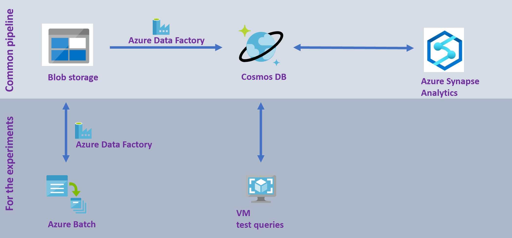

# Geospatial queries on CosmosDB and Azure Synapse Analytics

In this repository you will find the code and pipelines to run geospatial queries against an Azure Cosmos DB instance. While focussing here on the data ingestion and queries, we also made the connection to Azure Synapse Analytics, in order to perform large scale, big data processing on a Spark cluster with the data stored in Cosmos DB.

This repository is the technical back-bone from the .. blog post where the exeriments and the results are described.

As input data for the experiments we make use of the US building footprints, that have been created through a deeplearning approach on aerial photos resulting in around 125 milion building footprints. The source data can be found at: https://github.com/microsoft/USBuildingFootprints 

### General set-up

Here, two approaches are presented:
- the common usage pattern: direct data ingestion into CosmosDB and usage from Azure Synapse Analytics
- the experiment set-up: data preprocessing to accomadate the experiments before data ingestion into CosmosDB and queries from a VM with a C# application

### Common usage pattern

With the geospatial indexation and query capabilities, you are able to fastly extract your geospatial feature from Cosmos DB, and hence enrich the data in an analytic engine, like the Azure Synapse Analytics Spark Pool. The ingestion of (zipped) geojson files, stored on Blob, into Cosmos DB can be achieved by a copy activity with Azure Data Factory, which is described [here](/AzureDataFactory/README.md), under the AzureDataFactory folder. An example of big geospatial data analytics is given [here](/Synapse/README.md), under the Synapse folder.

### The experiment set-up
For the experiments that are described in blog post .. the need exists to control the number of geojson files to be ingested into Cosmos DB. We decided to split the large original geojson files into small files, each containing just 1 geospatial feature. In other words, we created milions of geojson files. With the approach we took, we were in theory able to have 50 concurrent processing streams, with the 50 US states and thus files. Still, this is a far slower process, so if you don't want to execute similar experiments, we recommend you to follow the approach given under 'Common usage pattern' above. 
Splitting the files can be done through an Azure Batch approach, that we have embedded in an Azure Data Factory pipeline, that pipeline is explained [here](/AzureDataFactory/README.md), under the AzureDataFactory folder, and the Azure Batch code is given [here](/ProcessGeospatialAndQueryCosmosDB/README.md), under the ProcessGeospatialAndQueryCosmosDB folder.
The geospatial performance tests were run on a VM with a C# application, explained [here](/PerformanceTests/README.md), under the PerformanceTests folder.

